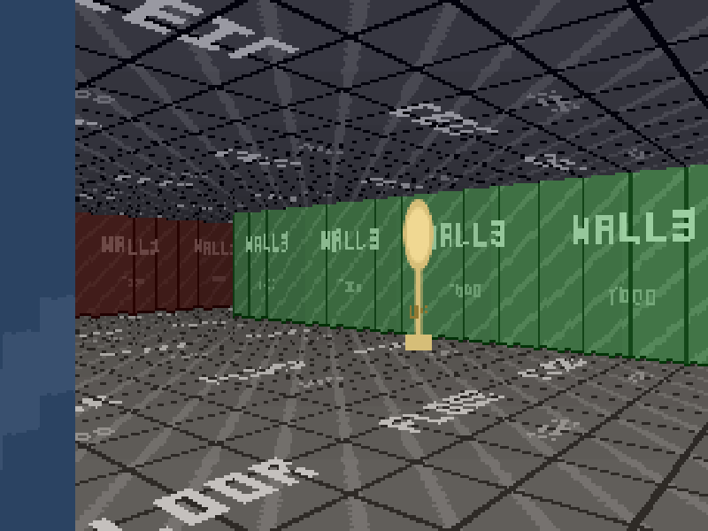

# ray

A Wolfenstein 3D–style raycaster in TypeScript, built in seventeen stages you can check out
and run individually.

Everything is drawn by hand into a 320×200 buffer of 32-bit pixels — no WebGL, no canvas
drawing calls beyond a single scaled blit per frame.

Textures are PNG files loaded before the first frame. The images that ship are deliberately
ugly placeholders; drop your own 64×64 PNGs into `src/assets/images/` to replace them.

```bash
npm install
npm run dev
```

Press <kbd>H</kbd> in the browser for controls.



---

## The walkthrough

Each stage is one commit and one tag, with a document explaining what it added and why.
`git diff stage-03-dda stage-04-first-3d` shows exactly what one idea costs in code.

| | stage | what it adds |
| --- | --- | --- |
| 1 | [skeleton](docs/stage-01-skeleton.md) | The software framebuffer, the upscale pipeline, a fixed-timestep loop |
| 2 | [map and movement](docs/stage-02-map-and-movement.md) | ASCII levels, the camera as direction + plane, both control schemes |
| 3 | [DDA](docs/stage-03-dda.md) | Casting 320 rays through the grid, exactly and cheaply |
| 4 | [first 3D view](docs/stage-04-first-3d.md) | `VIEW_H / perpDist` — the entire projection |
| 5 | [distance shading](docs/stage-05-shading.md) | Depth from brightness, and cheap per-pixel colour arithmetic |
| 6 | [textures](docs/stage-06-textures.md) | `wallX`, fixed-point column stepping, texture mapping |
| 7 | [floors and ceilings](docs/stage-07-floors-and-ceilings.md) | Row-based casting — the first genuinely per-pixel pass |
| 8 | [collision](docs/stage-08-collision.md) | Circle-vs-grid with contact-normal sliding |
| 9 | [doors](docs/stage-09-doors.md) | Recessed sliding slabs, and the one cell the DDA passes through |
| 10 | [sprites](docs/stage-10-sprites.md) | Billboards, depth testing, painter ordering |
| 11 | [polish](docs/stage-11-polish.md) | Minimap, help overlay, edge anti-aliasing, performance |
| 12 | [image textures](docs/stage-12-image-textures.md) | Loading real PNGs: async boot, a manifest, alpha, orientation |
| 13 | [blocking sprites](docs/stage-13-blocking-sprites.md) | Objects stop being scenery you walk through |
| 14 | [directional sprites](docs/stage-14-directional-sprites.md) | Eight-way facing, animation sheets, the behaviour hook |
| 15 | [pushwalls](docs/stage-15-pushwalls.md) | A whole cell that moves: ray-vs-box, and a solid surface off the grid |
| 16 | [audio](docs/stage-16-audio.md) | An event bus, positional sound, and the camera plane as a pair of ears |
| 17 | [extension points](docs/stage-17-extension-points.md) | The seams a game attaches to, and [a guide to them](docs/extending.md) |

---

## The shape of the engine

A frame is four passes over a 320×200 buffer:

```
  cast 320 rays          one per screen column, DDA through the grid
        │
        ▼
  walls                  one vertical span per column, recording what each covers
        │
        ▼
  floors and ceilings    per row, skipping whatever the walls already claimed
        │
        ▼
  sprites                sorted far to near, depth-tested against the ray fan
                         (a directional sprite picks its cell from the viewing angle)
```

Three ideas do most of the work:

**The camera is a direction vector and a perpendicular plane, not an angle.** Rays are
spread along a straight line rather than evenly in angle, which is why there is no fisheye
distortion to correct — see [stage 3](docs/stage-03-dda.md).

**Distances are measured in ray lengths.** Because `rayDir · dir == 1` for every column,
"distance along the ray" and "perpendicular distance to the camera plane" are the same
number. Wall heights, floor rows, sprite depths and the depth test all share one unit,
with nothing to convert between them.

**Almost everything is on the grid.** Two things are not, and both had to be solved for
rather than landed on: a door's slab, half a cell inside its cell, and a
[pushwall](docs/stage-15-pushwalls.md)'s box, which slides between cells entirely.

**The camera cannot tilt.** That single constraint makes wall columns constant-depth,
screen rows constant-depth, and billboards indistinguishable from cylinders. Almost every
shortcut in the renderer traces back to it, and so does every limitation.

---

## Cost

Measured at 320×200, median of 3000 frames, against a 16.67 ms budget:

| pass | time |
| --- | --- |
| world update (entities, doors, pushwalls, events) | 0.001 ms |
| raycast, 320 rays | 0.014 ms |
| walls | 0.045 ms |
| floors and ceilings | 0.093 ms |
| sprites (20 objects, 3 animated) | 0.002 ms |
| edge anti-aliasing | 0.007 ms |
| **full frame** | **0.158 ms** |

Retained heap growth over 300 frames: **0 KB**. Nothing in the render path or the tick
allocates — which is why the event bus takes three numbers rather than an event object. The
asynchronous code is the texture load, which runs once before the first frame, and the sound
load, which deliberately does not block it.

---

## Layout

```
src/
  config.ts             tunable constants
  main.ts               the only file that touches the DOM
  player.ts             position, direction, camera plane, movement
  engine/               framebuffer and pixel packing — knows nothing about the game
  world/                map, doors, pushwalls, collision, entities, behaviours
  audio/                sound manifest, loader, mixer, positional maths
  core/                 fixed-timestep loop, world event bus
  render/               raycast, walls, floors, sprites, lighting, minimap, overlays
  assets/               the texture manifest and loader, plus the PNGs and Ogg files
docs/                   one document per stage
tools/                  placeholder generator, sprite-sheet importer, verification scripts
```

`engine/` and `core/` never import from `world/`; `render/` never mutates game state; and
`world/` knows nothing about `audio/` — it announces on an event bus that audio subscribes
to, which is the seam a game hangs its own listeners on.

---

---

## Replacing the artwork

Every texture is a 64×64 PNG in `src/assets/images/`, listed in `src/assets/manifest.ts`.
Replace a file and it appears on the next reload. Four rules the loader cannot enforce for
you, covered in [stage 12](docs/stage-12-image-textures.md):

- wall images repeat once per cell, so their left and right edges must meet
- floor and ceiling images tile in **both** axes
- sprites need transparent margins and should stand on the bottom edge of the image
- everything must be exactly 64×64 (the loader checks this one, and names the file)

Animated sprites are **sheets**: 64px cells, eight columns for the eight stored directions
and one row per animation frame — see [stage 14](docs/stage-14-directional-sprites.md).
`node tools/import-sprites.mjs <source.png> <out.png> --rows=...` converts a third-party
sheet into that layout, and `node tools/make-placeholders.mjs` regenerates the stand-in
artwork (it leaves existing files alone unless you pass `--force`).

The monster is third-party CC0 art; everything else is a generated placeholder. See
[CREDITS.md](CREDITS.md).

## Writing a game on top of it

The engine is finished and the game is not written. **[docs/extending.md](docs/extending.md)**
is the map of where the two meet: entity behaviours, spawning, the event bus, visibility
queries, collision, and where a HUD or a weapon overlay goes in the frame.

```
raycast → walls → floors → sprites → edge AA → [ your overlays ] → present
```

---

## Things it deliberately does not do

- **No sloped floors, room-over-room, or looking up and down.** All ruled out by the fixed
  camera height, which is what everything else is built on.
- **No front-to-back audio.** Stereo carries one axis; telling ahead from behind needs
  head-related transfer functions, which cost more than everything else here put together.
- **No combat, enemies, or game logic.** Sprites face and animate, and there is a per-entity
  behaviour hook, but nothing in `src/` decides to attack you. The patrol driver in
  `world/demo-patrol.ts` is a demonstration of the hook and is safe to delete.
- **No test framework.** Verification is a set of plain scripts under
  [`tools/verify/`](tools/verify/) that import the real modules and assert against them:
  `npm run verify -- --all`. What each stage checked is written up in its document.
