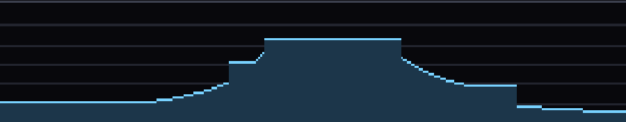
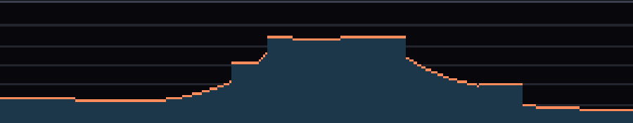

# Stage 3 — Casting the rays

**Tag:** `stage-03-dda`
**Diff:** `git diff stage-02-map-and-movement stage-03-dda`

320 rays, one per screen column, each finding the first wall in its path. This is the
raycaster. Everything after this stage is about what to *draw* with the answers.

Still no 3D view — the rays are drawn on the top-down map instead, because that is where
you can actually see whether they are right.

---

## Why not just step along the ray?

The obvious approach is to march forward in small increments and check the cell at each
point:

```
for (t = 0; t < maxRange; t += 0.05) {
  if (map.isSolid(floor(x + dx*t), floor(y + dy*t))) break;
}
```

This is what most first attempts look like, and it is wrong in three ways at once.

**It is inaccurate.** The wall is found somewhere within one step of its true face, so the
distance is only ever approximate. Wall heights jitter as you move, and — fatally for
Stage 6 — there is no way to work out *where along the wall* the ray struck, so you cannot
compute a texture coordinate.

**It is slow.** 0.05 units per step means 20 samples per cell, most of them in open air,
and the cost is paid per ray per frame.

**It tunnels.** Make the step bigger to claw back the speed, and rays start skipping
through thin walls at glancing angles, punching holes in the geometry.

There is no step size that fixes all three, because the premise is wrong. Sampling is the
wrong tool for a question about a regular grid.

---

## The DDA

[`src/render/raycast.ts`](../src/render/raycast.ts)

A digital differential analyser doesn't sample. It jumps directly from one grid line to the
next, visiting exactly the cells the ray passes through, in order, and landing precisely on
the face it hits.

```
    ┌────┬────┬────┬────┐      × = a grid crossing the DDA lands on
    │    │    │    │    │
    ├────┼────×════╗────┤      each step takes whichever crossing is
    │    │   ╱│    ║    │      nearer: the next vertical grid line,
    ├────┼──×─┼────╫────┤      or the next horizontal one
    │    │ ╱  │    ║    │
    ├────┼×───┼────╫────┤
    │   ╱│    │    ║    │
    └──●─┴────┴────╨────┘
     player                    ═╗ the face it stops on
```

The insight it turns on: because the grid is regular, **the distance between successive
vertical crossings is a constant** for a given ray. Work it out once and every subsequent
step is one addition.

### deltaDist — the cost of crossing one cell

Travel a parameter distance `t` along the ray and you move `(rayDirX * t, rayDirY * t)`.
To move exactly one cell horizontally you need `rayDirX * t = 1`, so:

```
deltaDistX = |1 / rayDirX|      distance to cross one full cell in x
deltaDistY = |1 / rayDirY|      … and in y
```

A ray aimed nearly straight up crosses vertical grid lines very rarely, so `deltaDistX` is
enormous. Aimed *exactly* up, never — and the value is `Infinity`.

Which is fine, and this is one of the rare places where dividing by zero is not just
survivable but useful. `Infinity` compares and adds correctly, so that axis simply never
wins the "which crossing is nearer?" test, and the loop only ever steps the other way.
No special case, no branch in the hot loop.

### sideDist — where the first crossing is

`deltaDist` is the distance between crossings, but the *first* one is a partial cell: it
depends on where in the cell you are standing.

```
       ├──── sideDistX ────┤
   ●───┼───────────────────┼──────  first vertical line ahead
   │   │                   │
  posX floor(posX)+1       next
```

Hence the four-way setup for the two axes and two directions. Facing +x, the fraction left
to cross is `mapX + 1 - posX`; facing −x it is `posX - mapX`.

### One NaN worth guarding

`0 * Infinity` is `NaN`, and that combination arises for real: a ray exactly axis-aligned
*and* a player standing exactly on a grid line. `NaN` loses every comparison, so that axis
would win the step test forever and the loop would run off in one direction.

```ts
if (Number.isNaN(sideDistX)) sideDistX = Infinity;
```

Two lines, and it is genuinely reachable — spawn facing exactly north with an integer x
coordinate and you are in it.

### The loop

```ts
for (;;) {
  if (sideDistX < sideDistY) { sideDistX += deltaDistX; mapX += stepX; side = 0; }
  else                       { sideDistY += deltaDistY; mapY += stepY; side = 1; }
  if (isSolidTile(map.tileAt(mapX, mapY))) break;
}
```

That is the whole algorithm. One comparison, one add, one array lookup per cell crossed.

**And it needs no iteration cap.** This is where Stage 2's decision pays off: `tileAt`
reports everything outside the map as solid, so even a ray that escapes through a gap
terminates at the edge of the array. Without that, a stray ray would spin forever — 320
times a frame, so the tab would simply lock up.

The loop adds `deltaDist` *before* testing, so on exit `sideDist` holds the distance to the
crossing *past* the wall. Subtracting one `deltaDist` backs up to the face actually hit.

---

## The good part: the distance is already perpendicular

`perpDist` needs no fisheye correction. Not because we correct it — because of what the
units are.

All these distances are in multiples of the **ray vector**, which is not a unit vector:

```
rayDir = dir + plane * cameraX
```

Now project that onto the viewing direction, remembering that `dir` is unit length and
`plane` is perpendicular to it:

```
rayDir · dir = (dir + plane * cameraX) · dir
             = dir·dir + cameraX * (plane·dir)
             = 1       + cameraX * 0
             = 1
```

**Exactly 1, for every column on the screen.** So travelling `t` ray-lengths always
advances you `t` along the viewing axis, whatever direction the ray points. "Distance in
ray lengths" and "perpendicular distance to the camera plane" are the same number.

The correction that other formulations apply after the fact — multiplying by
`cos(rayAngle - playerAngle)` — is doing exactly this, undoing a unit-normalisation that
was never necessary. Choose the units well and the problem does not arise.

---

## Seeing the fisheye

The strip along the bottom plots what each ray returned, one pixel per column. It is a
preview of the depth buffer: in Stage 4 these distances become wall heights directly, so
**the shape of this line is the shape of the wall you are about to see**.

Press <kbd>F</kbd> to switch which distance it plots. Facing east from the spawn, at a
distant flat wall:

Perpendicular — the plateau is flat:



Euclidean — the same plateau lifts at both ends:



Every point on a flat wall is the same distance from the camera *plane*, so perpendicular
distance is constant and the wall renders flat. But the corners of that wall really are
further from your *eye* than its centre is — so euclidean distance grows toward the edges
of the screen, those columns get drawn shorter, and the wall bows away from you. That is
fisheye, and that upward curl at the edges is precisely its shape.

The effect is proportional, so it shows up on distant walls and is invisible on close ones.
Face something far away when you try it.

---

## Two small things that are not accidents

**Rays are cast at pixel centres.**

```ts
const cameraX = (2 * (x + 0.5)) / count - 1;
```

The `+ 0.5` samples the middle of each column rather than its left edge, removing a
half-pixel bias across the image. It also means `cameraX` is never exactly zero, so no ray
is ever exactly axis-parallel while the player faces along an axis — the degenerate case
above becomes unreachable through normal play.

**`RayFan` owns its results.** 320 rays a frame at 60fps is 19,200 objects a second. The
fan allocates its `RayHit`s once and overwrites them, so casting allocates nothing. Doing
this from the start costs nothing; retrofitting it later means touching every call site.

---

## Running it

```bash
npm run dev
```

<kbd>R</kbd> cycles how many rays are drawn · <kbd>F</kbd> switches the distance measure

### Verify

1. **Every ray ends on a wall face.** Not short of one, not inside a wall. Press
   <kbd>R</kbd> until every ray is drawn and look along the edges of the pillar blocks.
2. **Rays that miss a pillar shoot past it.** Stand near one of the freestanding blocks:
   the rays either side should carry on into the distance while the ones that strike it
   stop dead. That sharp discontinuity is the DDA hitting exactly the right cell.
3. **The fan is symmetric** and its far edge is a straight line, not an arc.
4. **Turn slowly.** The fan should sweep smoothly with no ray snapping or flickering,
   especially as you pass through exactly north/south/east/west — that is the `Infinity`
   path, and any flicker means the degenerate case is not handled.
5. **The flat-wall test.** Face a distant flat wall square-on. The profile plateau must be
   perfectly flat; press <kbd>F</kbd> and it should visibly lift at both ends.
6. **Walk into a wall** (there is still no collision). The profile should stay sane and
   distances go to near zero, not negative or `NaN`.
7. **Rays alternate colour along a wall** — the two shades are x-side and y-side hits. On a
   long flat wall seen at an angle you get runs of one colour broken by the other where the
   ray clips a corner.

---

## What changed

```
+ src/render/raycast.ts       castRay (the DDA), RayHit, RayFan
+ src/render/depthprofile.ts  the distance graph along the bottom
~ src/render/minimap.ts       drawRays; layout now takes a bounds rect
~ src/main.ts                 casts the fan, F and R toggles
```

---

## Next

**Stage 4** finally turns sideways. Wall height is `VIEW_H / perpDist` — that one division
is the entire 3D projection — and the profile curve you have been looking at becomes the
silhouette of the world.
