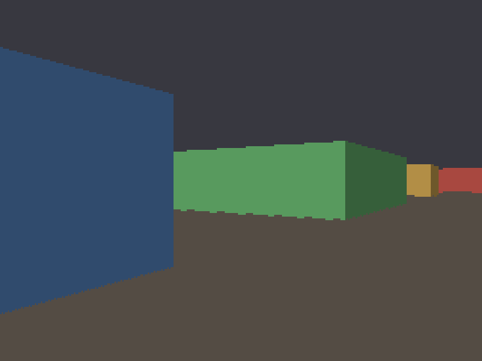

# Stage 4 — The first 3D view

**Tag:** `stage-04-first-3d`
**Diff:** `git diff stage-03-dda stage-04-first-3d`

The distances from Stage 3 become a picture. This is the shortest stage in the walkthrough
and the one where it suddenly looks like a game.



---

## One division

Walls are one world unit tall, and Stage 3 established that the camera plane sits exactly
one unit in front of the eye — that was the meaning of `rayDir · dir == 1`. So similar
triangles give the projected height directly:

```
      wall (1 unit tall)
        │╲
        │  ╲                h / 1  =  1 / d
      1 │    ╲
        │   h ╲             projected height = 1/d
        │      ╲
      ──┴───────●  eye
        │←  d  →│
        └─ plane at distance 1
```

Scaling into pixels picks the constant: multiplying by `VIEW_H` means a wall exactly fills
the screen when it is one unit away.

```ts
const lineHeight = VIEW_H / perpDist;
const top    = horizon - lineHeight / 2;
const bottom = top + lineHeight;
```

That is the whole projection. No matrices, no view frustum, no perspective divide beyond
this one division per column.

The column is centred on the horizon because the eye sits at wall mid-height. Nothing in
the code can express any other arrangement, and that is the point — the vertical axis is
not really being simulated at all. Which is exactly why this engine is fast enough to run
in 1992, and equally why it can never have sloped floors, stacked rooms, or a view that
tilts up and down. Wolfenstein's design constraints are visible right here in this one
line.

---

## Why the columns are not clamped

```ts
const top = Math.round(horizon - lineHeight / 2);
```

When you stand close to a wall, `lineHeight` is far larger than the screen and `top` goes
deeply negative. It stays that way: `verticalSpan` clips as it draws.

That matters from Stage 6. A wall running off the top of the screen must still sample the
correct part of its texture, and the only way to know which part is to know where the
column *would* have started. Clamp early and the texture slides as you approach a wall.

The extremes are safe. Walk into a wall (there is still no collision) and `perpDist`
approaches zero, `lineHeight` approaches `Infinity`, `top` becomes `-Infinity` — and
`verticalSpan` clips that to a full-height column, which is the right answer.

---

## The one shading trick holding the image together

Every wall face is drawn flat, so the only thing distinguishing one from another is
`SIDE_SHADE`: y-side faces are drawn at 62% brightness, x-side faces at full.

```ts
fb.verticalSpan(x, top, bottom, hit.side === 1 ? colors.dark : colors.light);
```

Set it to `1.0` and try it. The scene collapses into flat silhouettes — every corner
vanishes and you genuinely cannot tell where one wall ends and the next begins. One
multiplier is doing all the work of making the image legible as three dimensions, and the
original used exactly this trick.

The colours are darkened once at startup rather than per column. Walls are flat-shaded
here, so there are only a handful of distinct colours on screen and no reason yet to think
about fast colour arithmetic. Stage 5 is where that question becomes real.

---

## Fisheye, now visible

Press <kbd>F</kbd> and the walls bow. Same switch as Stage 3, but now you can see what the
depth profile was predicting.

Measured from the running renderer — the row where each column's wall starts, standing at
one spot facing a corner:

| column | 0 | 40 | 80 | **160** | 240 | 300 | 319 |
| --- | --- | --- | --- | --- | --- | --- | --- |
| perpendicular | 26 | 35 | 44 | **82** | 81 | 93 | 93 |
| euclidean | 38 | 42 | 47 | **82** | 82 | 94 | 94 |

Identical at the centre of the screen, and increasingly wrong toward the edges — the wall
tops sink, so the wall curls away from you. The ratio between the two distances is exactly
`|rayDir|`, which is `1` dead ahead and rises to about `1.197` at the edge of a 66° field
of view.

This is why the fisheye correction exists in formulations that normalise the ray direction.
We never normalised it, so there is nothing to correct.

---

## The top-down view is still there

<kbd>M</kbd> switches between the first-person view and the Stage 2/3 map. It is kept
rather than deleted because it stays useful: doors in Stage 9 and sprite positions in
Stage 10 are both far easier to debug from above. In Stage 11 it becomes an in-game
minimap in the corner.

---

## Running it

```bash
npm run dev
```

<kbd>M</kbd> first-person / top-down · <kbd>F</kbd> fisheye · <kbd>R</kbd> ray density (top-down)

### Verify

1. **Walls are vertical and straight-edged.** Any lean or wobble means the column top and
   bottom are not symmetric about the horizon.
2. **Walking toward a wall grows it smoothly** and it fills the screen at one unit away.
3. **Corners are legible.** Where two faces of a block meet you should see a clean light/dark
   step. That step is `SIDE_SHADE` and nothing else.
4. **The horizon never moves.** It sits at exactly `VIEW_H / 2` regardless of where you
   stand or face. This engine cannot look up or down and should not appear to.
5. **The fisheye toggle bows the walls** and leaves the centre of the screen untouched.
6. **Walk through a wall into the void.** It should not crash, produce `NaN`, or draw
   garbage — just a full-height column as distance approaches zero.
7. **Cross-check against the map.** Press <kbd>M</kbd>, note which walls the rays are
   hitting, switch back, and confirm the colours in front of you are the same ones.
8. **Stand in the narrow gap between the top-left pillars.** Thin slivers of wall at a
   glancing angle are where a projection error would show first.

---

## What changed

```
+ src/render/walls.ts    the projection, wall palettes, side shading
~ src/main.ts            view mode toggle (M), draws the 3D view by default
```

---

## Next

**Stage 5** adds distance shading, so that depth reads from brightness rather than only
from the geometry — and with it the question of how to do per-pixel colour arithmetic
without paying for it.
