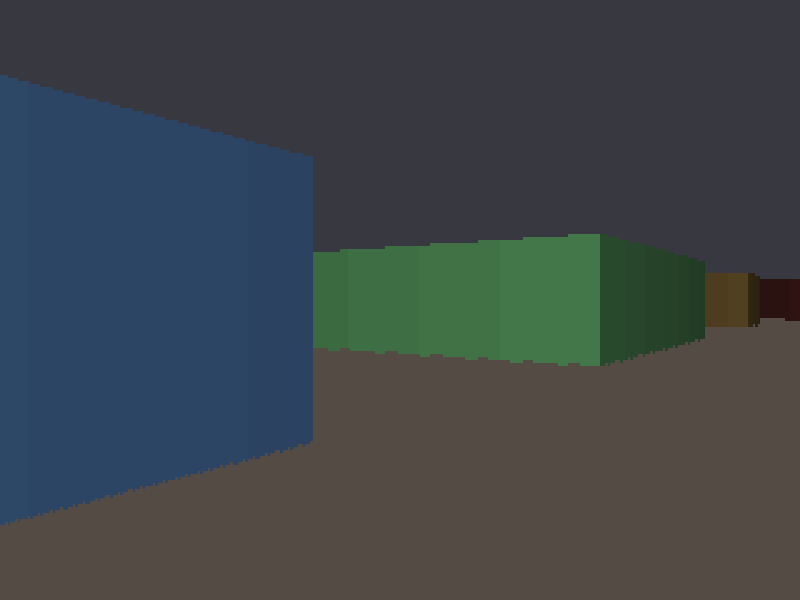
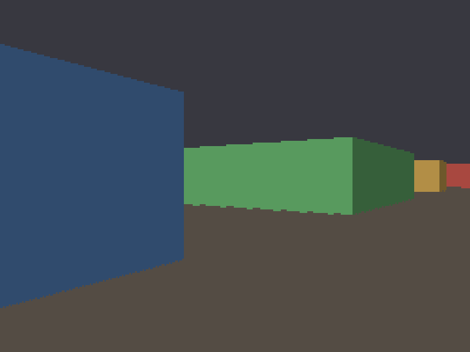

# Stage 5 — Distance shading

**Tag:** `stage-05-shading`
**Diff:** `git diff stage-04-first-3d stage-05-shading`

Things get darker as they get further away. It is a small amount of code and a large
change to how legible the world is — and it is where the renderer first has to care about
the cost of arithmetic.

Shading on:



Shading off — press <kbd>L</kbd>:



Look at the door at the end of the corridor. Unshaded it is exactly as bright as the wall
two units from your face, and the image reads as flat coloured shapes rather than as
space. Nothing about the *geometry* changed between those two pictures.

---

## A confession about the history

**Wolfenstein 3D did not do this.** Its walls were flat colours with only the light/dark
side distinction from Stage 4. Depth shading arrived with Doom, which precomputed 32
brightness levels of its entire 256-colour palette into "colormap" tables and selected a
row per distance zone.

It is here anyway, because the improvement is large and because it is the natural place to
meet the problem that shapes everything after it: doing colour arithmetic per pixel,
cheaply.

---

## The cost problem

Shading a wall is not demanding — one colour per column, 320 a frame. You could unpack
three bytes, multiply each by a float, clamp, and repack, and never notice.

Stage 7 casts textured floors and ceilings. That is a shading decision for **every pixel
below and above the horizon** — over 30,000 a frame, in the innermost loop of the renderer,
on top of a texture lookup. The naive version is roughly a dozen operations each, and it
is the difference between a comfortable frame budget and a struggling one.

So the technique is introduced now, while there is one easy caller to check it against,
rather than in the middle of the stage where floors are already hard enough.

---

## Multiplying four channels with two multiplies

[`shade()` in `src/engine/color.ts`](../src/engine/color.ts)

You cannot simply multiply a packed colour by a factor: each byte's product needs 16 bits
and would carry into its neighbour, so red would bleed into green.

But *alternate* bytes can be done together. Mask out bytes 0 and 2, and each sits in its
own 16-bit lane with eight bits of headroom:

```
  colour        AA BB GG RR
  & 0x00ff00ff  __ BB __ RR      two lanes, 8 bits of headroom each
  * factor      ?BB?BB ?RR?RR    each product up to 255*256 — still fits
  >>> 8         __ BB __ RR      back down, scaled
  & 0x00ff00ff                   drop whatever spilled between lanes
```

Repeat for the odd bytes, shift them back into place, recombine. Two multiplies for four
channels, no unpacking, no clamping — the maths cannot overflow a byte because the factor
is capped at 256.

`factor` is an integer in `0..256` where 256 means unchanged. A power of two, so dividing
back down is a shift rather than a division.

The alpha channel gets scaled along with the rest and is forced back to opaque at the end,
which is cheaper than trying to exclude it.

This is worth verifying rather than trusting — it is exactly the sort of code that looks
right and is subtly wrong. It is checked against a slow reference implementation across
610,944 colour/factor combinations, plus specific tests that pure red stays pure red with
nothing bleeding into the neighbouring channels.

---

## The falloff curve

[`src/render/lighting.ts`](../src/render/lighting.ts)

Brightness falls linearly from full at the eye to `MIN_LIGHT` at `LIGHT_RANGE` (16 units),
precomputed into a 129-entry table indexed by distance.

The table is not really about saving the arithmetic — the curve is only a subtract and a
multiply. It is about Stage 7 calling this per pixel, where a small table that stays in
cache beats recomputing, and where having *one* place that defines the light curve means
walls, floors and sprites cannot drift out of agreement.

**`MIN_LIGHT` is 0.2, not 0.** Distant walls fading to pure black would vanish against the
still-unshaded flat floor and read as holes in the world. Once Stage 7 shades floors with
this same curve, it can go much lower.

**Shading uses `perpDist`, never euclidean.** Euclidean distance is larger toward the edges
of the screen, so it would darken the screen edges more than the centre — a vignette that
swims as you turn. The fisheye toggle deliberately does not affect lighting, which is why
pressing <kbd>F</kbd> changes the shape of the walls but not their brightness.

### Banding is a choice here, not a constraint

Doom banded because it had to: each brightness level cost a 256-byte palette table, so 32
levels was a genuine memory decision. We are in true colour and could shade continuously
for free.

`SHADE_LEVELS` is 32 anyway, because the stepping is characteristic of the era. Raise it to
256 for a smooth modern gradient, or drop it to 8 to watch harsh bands march toward you as
you walk.

One subtlety worth the two lines it costs: the **distance** is quantised, not the
brightness. Rounding the brightness instead spreads 32 levels across the full 0..1 range
when the curve only ever occupies 0.2..1.0 — quietly collapsing them into 26. Verified by
counting distinct outputs.

---

## Two brightness factors, combined

```ts
const side = hit.side === 1 ? SIDE_SHADE : LIGHT_UNIT;
const depth = lighting ? lightFactor(hit.perpDist) : LIGHT_UNIT;
const brightness = (side * depth) >> 8;
```

Both are `0..256`, so combining them is a multiply and a shift back down — still integers,
no floats anywhere in the path. Stage 4's precomputed light/dark palette pairs are gone;
there is one base colour per tile now, and everything else is computed.

---

## Running it

```bash
npm run dev
```

<kbd>L</kbd> shading on/off · <kbd>M</kbd> view · <kbd>F</kbd> fisheye

### Verify

1. **Toggle <kbd>L</kbd> down a long corridor.** The depth cue should appear and vanish
   completely. This is the whole point of the stage.
2. **Walk toward a distant wall.** It should brighten smoothly and continuously, with no
   jump or flicker as you cross band boundaries.
3. **Corners still read correctly.** Distance and side shading multiply, so a far wall's
   two faces should still differ in brightness — just both darker.
4. **Colours stay true.** A shaded red wall must be dark red, never brown, purple or grey.
   Any hue shift means channels are bleeding into each other in `shade()`.
5. **Nothing goes fully black.** Distant walls must stay distinguishable from the ceiling.
6. **Press <kbd>F</kbd>.** The walls should bow *without* changing brightness — lighting
   uses perpendicular distance regardless.
7. **Try `SHADE_LEVELS = 8`** in [`lighting.ts`](../src/render/lighting.ts) and walk down a
   corridor. The bands become obvious and you can watch them sweep past you.

---

## What changed

```
+ src/render/lighting.ts   the falloff curve and its lookup table
~ src/engine/color.ts      shade(), the two-multiply channel scale
~ src/render/walls.ts      one base colour per tile; side x depth brightness
~ src/main.ts              L toggle
```

---

## Next

**Stage 6** replaces flat colours with textures: generating them procedurally, finding
exactly where along a wall each ray struck, and walking down the column in fixed point.
