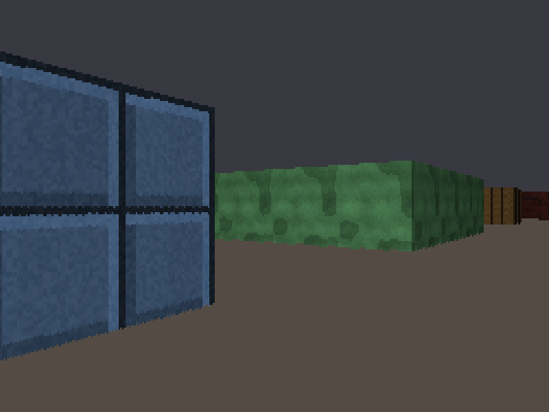
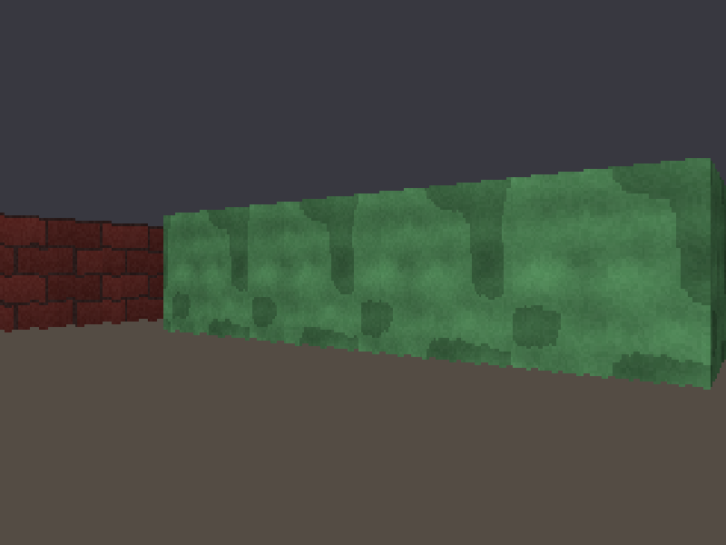

# Stage 6 — Textures

**Tag:** `stage-06-textures`
**Diff:** `git diff stage-05-shading stage-06-textures`

Flat colours become surfaces. Three things have to line up: knowing exactly *where* on a
wall each ray struck, walking down the screen column sampling the texture as you go, and
having a texture to sample in the first place.





---

## `wallX`: the coordinate that was already there

The texture coordinate across a wall costs almost nothing, because the DDA already
computed the exact hit point:

```ts
let wallX = side === 0 ? hitY : hitX;
wallX -= Math.floor(wallX);
```

An x-side face runs along y, so its coordinate is the fractional part of the hit's y — and
vice versa. That is the whole derivation.

It is worth pausing on why this is *exact*. Stage 3 rejected fixed-step ray marching partly
on accuracy grounds, and this is where that bill would have come due: a marched ray stops
somewhere *near* the wall, so the fractional position along the face is wrong by up to a
step, differently every frame. The texture would crawl and shimmer as you moved, and no
amount of smoothing would fix it. The DDA lands precisely on the face, so `wallX` is right
to full precision.

### The flip

```ts
if ((side === 0 && rayDirX > 0) || (side === 1 && rayDirY < 0)) wallX = 1 - wallX;
```

Left alone, the coordinate runs in whichever direction the world axis happens to point, so
the faces on opposite sides of a block come out mirrored from one another. On a symmetric
brick pattern you would never notice; on anything with writing, a handle, or a recognisable
motif it is immediately wrong — and it makes adjacent cells disagree about which way their
texture runs, producing a visible discontinuity at the seam.

Reversing the coordinate on the two faces the ray meets from behind lines every face up
consistently. Verified by sweeping 926 samples along one continuous wall and confirming the
coordinate advances the same direction in every cell.

---

## Walking down the column in fixed point

```ts
const step = ((TEX_SIZE * 65536) / drawn) | 0;
let texPos = (yStart - top) * step + (step >> 1);

for (let y = yStart; y < yEnd; y++) {
  const texel = texture[column + ((texPos >> 16) & TEX_MASK)];
  texPos += step;
  pixels[index] = shade(texel, brightness);
  index += width;
}
```

**16.16 fixed point.** The top 16 bits are the texel row, the bottom 16 a fraction. Integer
add plus shift, rather than float add plus truncate, in the loop that runs most often in
the whole renderer. The original had no floating-point unit and no choice; we do, and it is
still the better trade.

**`step` comes from `drawn`, the rounded on-screen height** — not the exact `lineHeight`.
Deriving it from the unrounded value lets the texture drift by a texel or so by the bottom
of a tall column, because the number of pixels actually drawn and the number the step
assumed disagree.

**`& TEX_MASK` instead of a clamp.** This is the reason `TEX_SIZE` must be a power of two.
Wrapping is free, so accumulated rounding at the bottom of a column cannot read past the
end of the array.

**`(yStart - top) * step`** handles clipping. `top` is deliberately left unclamped — the
decision made back in Stage 4 — so this is simply how far into the texture the first
*visible* row falls. Walk up to a wall until it overflows the screen and the texture stays
locked in place instead of sliding.

### Sampling at texel centres

`+ (step >> 1)` starts half a step in, so each screen pixel samples the middle of the
texture range it covers rather than its leading edge. Same reasoning as the `+ 0.5` on
`cameraX` in Stage 3.

I got this wrong first time and the verification caught it. Without the offset the texture
carries a systematic half-texel bias upward, and the bottom row goes unsampled on any wall
under 64 pixels tall — a 40-pixel column steps 0, 1, 3, … 62 and stops. Centring moves that
threshold to 32 pixels and makes the sampling symmetric.

A column under 32 pixels still cannot show every row: 17 screen pixels cannot display 64
texels. That is ordinary point sampling, and it is exactly where the shimmer on distant
walls comes from. Mipmaps are the real answer and are well outside what this engine does.

---

## Column-major textures

[`src/assets/textures.ts`](../src/assets/textures.ts)

The texel at (x, y) lives at `data[x * size + y]`, not the usual `data[y * size + x]`.

A wall slice is one screen column sampled down a single texture column: `texX` is fixed for
the whole span while `texY` marches top to bottom. In row-major order those texels are 64
entries apart, so every pixel touches a different cache line and the CPU stalls on memory
it cannot prefetch. Column-major makes them adjacent — the entire 256-byte column arrives
in a handful of cache lines.

One transposed index in the generators, paid back in the inner loop.

---

## Generating textures instead of loading them

No PNGs, no licensing, no asset pipeline — and the textures are *readable*. A brick wall is
a few lines of arithmetic you can edit and see the result of on the next hot reload.

Some things learned making them look like anything:

**Hash, never `Math.random()`.** Textures generated from a hash are identical on every run
and machine, so an artefact you notice today is still there tomorrow rather than being
dismissed as generation noise.

**Tint whole features, not texels.** The per-brick colour variation keys off the brick's
grid position, so a whole brick shifts as a unit. Key it off the texel and you get noise
that happens to be brick-shaped.

**One octave of noise is static.** `hash` per texel reads as television interference. Value
noise samples a coarser lattice and interpolates; stacking three octaves at halving scale
and amplitude gives large shapes with fine detail riding on them. The first version of the
mossy stone used a single nearest-neighbour octave and looked like 8×8 chequerboard mush.

**Smoothstep, not linear interpolation.** Linear leaves a visible crease along every
lattice line because the gradient jumps there. `t²(3−2t)` has zero derivative at both ends.

**Wrap the noise lattice.** Every wall cell draws a full copy of the texture, so a texture
that does not tile shows a hard vertical seam at every cell boundary along a continuous
wall. Taking lattice coordinates modulo the period makes the right edge interpolate back
toward the left. Verified: the wrap seam is 5.7 average channel delta against 25.1 for two
arbitrary columns.

**Bevels sell flat surfaces.** A light edge along the top and left of each stone block and
a dark one along the bottom and right implies a light source. It is Stage 4's side shading
one level down, and it does more for the look than any amount of noise tuning.

---

## Running it

```bash
npm run dev
```

<kbd>T</kbd> textures on/off · <kbd>L</kbd> shading · <kbd>M</kbd> view · <kbd>F</kbd> fisheye

### Verify

1. **Press <kbd>T</kbd> repeatedly.** Flat colours and textures should show identical
   geometry — same silhouettes, same edges, only the surface differs.
2. **Walk along a long wall.** The texture must slide past evenly, with no swimming,
   stretching, or jumping at cell boundaries.
3. **Look at a corner where two faces meet.** Both should be right way up and running the
   same direction. Mirroring here means the flip is wrong.
4. **Walk into a wall until it fills the screen.** The texture must stay locked, not slide
   or zoom oddly — that is the unclamped `top` doing its job.
5. **Stand where two cells of the same wall type meet.** No seam, no discontinuity, no
   mirrored repeat.
6. **Look at a wall from a very glancing angle.** Expect compression, and expect shimmer at
   distance. That is point sampling, not a bug.
7. **Check the door.** It should be obviously not-a-wall from across the room — this
   matters from Stage 9.
8. **Edit a texture.** Change `COURSE` or `LENGTH` in `brickTexture` and watch it reload.

---

## What changed

```
+ src/assets/textures.ts   procedural generators, value noise, column-major storage
~ src/render/raycast.ts    wallX, with the orientation flip
~ src/render/walls.ts      textured column loop in 16.16 fixed point
~ src/config.ts            TEX_SIZE, TEX_MASK
~ src/main.ts              T toggle
```

---

## Next

**Stage 7** casts the floor and ceiling. Those flat grey and brown bands become textured
surfaces receding to the horizon — and unlike walls, they are computed per *row*, with a
different texture coordinate at every single pixel. This is what the whole software
framebuffer was for.
