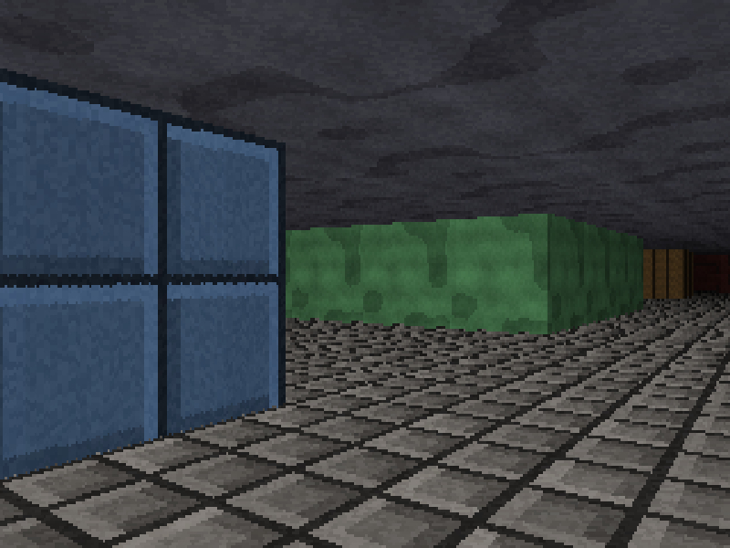
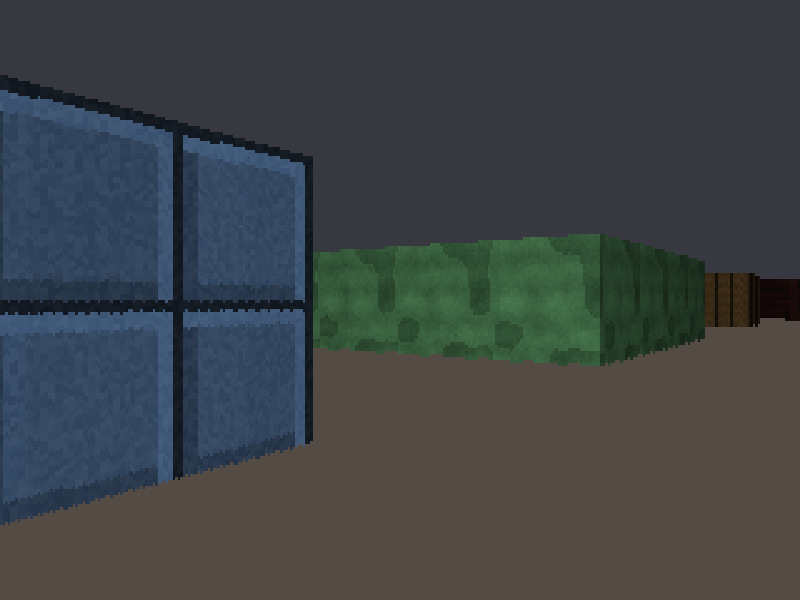

# Stage 7 — Floors and ceilings

**Tag:** `stage-07-floors-and-ceilings`
**Diff:** `git diff stage-06-textures stage-07-floors-and-ceilings`

The flat grey and brown bands become real surfaces receding to the horizon. This is the
stage the software framebuffer was chosen for back in Stage 1.



Flat bands, for comparison — press <kbd>C</kbd>:



---

## Rows, not columns

Every stage so far has worked in screen **columns**, because walls are vertical: one column
of a wall has one distance, one texture column, one brightness.

Floors are horizontal, so the constant thing is a screen **row**.

The camera sits at wall mid-height — half a unit above the floor — and cannot tilt. So
every pixel on a given row looks at a floor point exactly the same perpendicular distance
away:

```
           eye
            ●─────────────────  horizon
            │╲
        0.5 │  ╲  row y
            │    ╲
     ───────┴──────●──────────  floor
            │← d  →│

    (y - horizon) / VIEW_H  =  0.5 / d      →      d = 0.5 * VIEW_H / (y - horizon)
```

That is Stage 4's wall projection turned on its side and solved for distance instead of
height. **One division per row**, not per pixel.

It is also, quietly, the same constraint that made the wall projection one line. Because
the camera cannot tilt, screen rows correspond to constant depth. Give the engine the
ability to look up or down and this entire approach collapses — which is why games that
wanted that had to wait for a different renderer.

---

## Perspective-correct for free

With depth fixed for the whole row, the floor position at column x is

```
floorPos(x) = pos + rowDistance * rayDir(x)
```

and `rayDir(x) = dir + plane * cameraX` is linear in x. So the floor position is **linear
in x too**, and stepping it with a plain addition per pixel is not an approximation — it is
exact.

```ts
let floorX = player.x + rowDistance * rayDirX0 + stepX * 0.5;
// ...
floorX += stepX;   // exact, not an approximation
```

This is perspective-correct texture mapping, and we get it by working along a line of
constant depth. Interpolating texture coordinates linearly across a screen span covering
*varying* depths is precisely the shortcut that gave the PlayStation 1 its famously
wobbling textures — the hardware had no per-pixel divide, so it interpolated in screen
space and the texture swam. Here there is nothing to get wrong, because there is no depth
variation along the row to be wrong about.

One caveat worth knowing: repeated addition accumulates floating-point error across the
row, where computing `pos + step * x` directly would not. Over 320 steps the drift is
around 1e-13 — enough to land a texel differently at maybe 0.2% of pixels, and invisible.
The multiply-per-pixel version is exact but slower, and every engine of this era chose the
addition.

---

## The horizon divides by zero, and centre sampling fixes it

```ts
const p = y + 0.5 - horizon;
```

The row exactly on the horizon looks at a floor point infinitely far away, so `p` is zero
and `rowDistance` is `Infinity`. Sampling the row's *centre* instead asks about a point
half a pixel below the horizon — merely very distant (200 units) rather than infinite.

The `+ 0.5` is the same correction applied to `cameraX` in Stage 3 and to texture stepping
in Stage 6, and it is the third time it has turned out to also fix a degenerate case for
free. Consistency about where a pixel *is* keeps paying.

---

## Not painting what walls will cover

The straightforward order is: fill the whole screen with floor and ceiling, then draw walls
on top. It works, and it throws away a texture fetch and a shade for every pixel a wall
covers — in a corridor, most of the screen.

So walls go first and record what they covered:

```ts
export interface WallSpans {
  top: Int32Array;     // first row the wall covers, per column
  bottom: Int32Array;  // one past the last
}
```

and the floor pass skips those pixels. Below the horizon a wall always reaches down from
it, so the test is a single comparison:

```ts
if (y >= bottom[x]) { /* draw floor */ }
if (ceilY < top[x]) { /* draw ceiling */ }
```

The verification confirms both halves of that bargain: no wall pixel is overwritten, and no
pixel is left unwritten — checked across 150 camera positions, because an off-by-one in the
span logic shows up as a one-pixel seam that is very easy to miss by eye.

In Stage 10 this same per-column record returns as a proper depth buffer, which sprites
test against to decide whether they are hidden behind a wall.

---

## Does it agree with the walls?

Floors and walls are computed by completely separate derivations — a DDA stepping through
a grid, and a similar-triangles formula about screen rows. A wall's base sits exactly on
the floor, so they had better meet there.

Inverting the row-distance formula gives the screen row at which a floor point at the
wall's distance should appear. Measured against where the wall actually ended:

- **worst disagreement: 0.688 pixels** — within the one pixel of slack that rounding the
  wall's top and height independently allows.
- Evaluating the floor position at the wall's exact distance reproduces the DDA's hit point
  to **3.6 × 10⁻¹⁵ world units**.

That second number is the satisfying one. Two unrelated pieces of geometry, agreeing to the
limits of double precision.

---

## What it costs

Measured per frame at 320×200, median of 3000 renders:

| pass | time |
| --- | --- |
| raycast, 320 rays | 0.016 ms |
| + walls | 0.065 ms |
| + floors and ceilings, cast | **0.179 ms** |
| + floors and ceilings, flat bands | 0.107 ms |

Floor casting is 0.114 ms — **64% of the entire render**, and by far the most expensive
thing the engine does. It touches up to 64,000 pixels with a texture fetch and a shade
each, where walls touch a fraction of that.

This is what Stage 5 was preparing for when it built `shade()` out of two integer
multiplies rather than unpacking bytes. It is also comfortably inside the budget: 0.179 ms
against 16.67 ms leaves the frame about 99% idle.

Heap growth over 90 frames: **0 KB**. Nothing in the render path allocates.

---

## Two smaller decisions

**One floor texture for the whole level.** The map format has no per-cell floor data and
does not need any — Wolfenstein used a single flat colour for each. Doom introduced
per-sector flats, which is a map-format change rather than a renderer one.

**`MIN_LIGHT` dropped from 0.2 to 0.07.** Stage 5 had to keep distant walls fairly bright
because floors and ceilings were unshaded bands, and a wall fading to black against a lit
floor read as a hole punched in the world. Now everything darkens on the same curve, so the
far end of a corridor can actually go dark.

---

## Running it

```bash
npm run dev
```

<kbd>C</kbd> cast/flat floors · <kbd>T</kbd> textures · <kbd>L</kbd> shading · <kbd>M</kbd> view

### Verify

1. **Walk forward and watch the floor.** The flagstones should flow past smoothly and stay
   locked to the world — no sliding, no swimming, no shearing as you turn.
2. **Look at where a wall meets the floor.** One clean line. No gap showing through, no
   overlap, no flickering pixels along the join as you move.
3. **Check the grid lines up.** Floor joints should run parallel to the walls and meet them
   squarely, because both come from the same world coordinates.
4. **Look at the horizon.** Floor and ceiling should converge to a single line at exactly
   mid-screen and fade to near black, with no bright band or tearing at the join.
5. **Press <kbd>C</kbd> back and forth.** Geometry identical, surfaces completely different.
6. **Stand in a corner and spin.** The floor texture must rotate about you convincingly,
   staying attached to the world rather than to the screen.
7. **Watch the FPS while turning quickly.** It should not move — this is the most expensive
   pass in the renderer, and it costs the same regardless of what is on screen.

---

## What changed

```
+ src/render/floors.ts     row-based floor and ceiling casting
+ src/render/options.ts    RenderOptions, replacing a growing tail of booleans
~ src/render/walls.ts      records WallSpans; no longer fills ceiling/floor
~ src/assets/textures.ts   FLOOR_TEXTURE, CEILING_TEXTURE
~ src/render/lighting.ts   MIN_LIGHT 0.2 -> 0.07
~ src/main.ts              two-pass render, C toggle
```

---

## Next

**Stage 8** gives the walls substance: circle-versus-grid collision with sliding, so you
stop walking through them. After seven stages of flying through geometry it is a
surprisingly large change to how the world feels.
