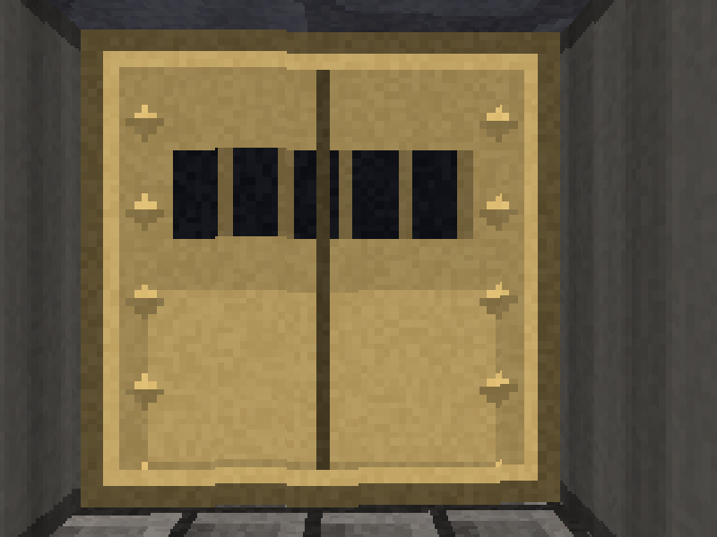
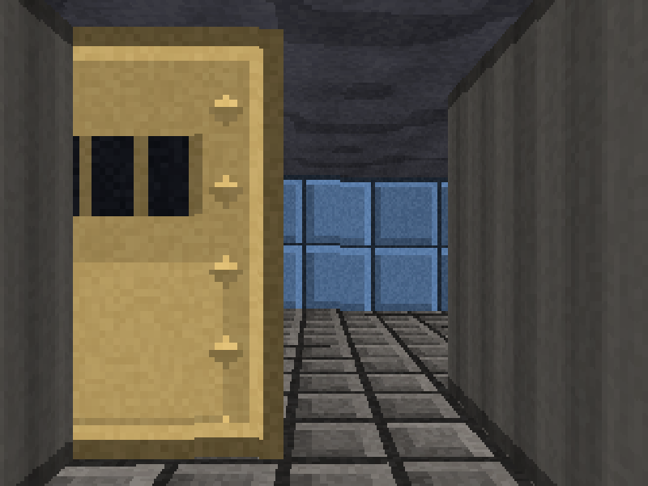

# Stage 9 — Doors

**Tag:** `stage-09-doors`
**Diff:** `git diff stage-08-collision stage-09-doors`

The fiddliest stage in the walkthrough. A door is not "a wall that is sometimes absent" —
it sits in a different *place* from a wall, it moves, and the thing it does to the ray loop
is the only case in the whole engine where a ray enters a cell and carries on through it.





Look at the two grey strips down the sides of the closed door. That is the **thickness of
the wall** — the recess the door sits inside — and it is what makes a doorway read as a
doorway rather than a picture hung on a flat surface.

---

## A door is half a unit inside its cell

Every wall face so far has lain on a cell boundary, which is exactly where the DDA already
stops. A door instead lies across the *middle* of its cell:

```
        cell
     ┌────────────┐
     │            │        the slab is at the cell's midpoint, so the DDA
     ├ ─ ─ ─ ─ ─ ─┤ ← slab never lands on it: the crossing has to be solved
     │      ↗     │        for once the ray is inside the cell
     └──────●─────┘
          ray in
```

So on entering a door cell the ray loop stops stepping and solves directly. For a door
whose slab spans x, sitting at `y = cellY + 0.5`:

```ts
distance = (cellY + 0.5 - posY) / rayDirY;
crossX   = posX + rayDirX * distance;
```

and then three ways it can miss:

- **Parallel.** `rayDirY === 0`, so the ray never reaches the plane.
- **Left first.** `crossX` falls outside the cell — the ray exited through a side before
  getting there.
- **Through the gap.** The crossing is in the retracted part of the slab.

Verified directly: a ray fired at a door stops at distance 1.0 from a point one and a half
cells away, where an ordinary wall in the same place stops it at 0.5.

### The only cell the DDA passes through

Every other tile either stops the ray or is empty. A door cell can be entered, missed, and
left — so the loop `continue`s rather than breaking, and carries on to whatever is beyond.
That single `continue` is what lets you see through a partly open door.

---

## The slab slides, it does not shrink

A door retracts into the adjacent wall. It is a rigid slab that *translates*, so at
openness `o` it occupies the span from `o` to `1`, and the material coordinate at position
`u` along the cell is `u - o`.

Getting this wrong is easy and looks plausible for about a second: scaling the texture into
the remaining gap gives a door that appears to **squash** rather than open. The difference
is that as a real door opens you see *less of the same picture*, not a compressed copy of
all of it.

The verification pins this down by tracking a fixed point on the material: opening the door
by 0.2 moves material coordinate 0.5 from screen position `u = 0.5` to `u = 0.7`, exactly
the distance the slab travelled.

---

## Jambs: the faces the recess exposes

Because the slab is set back half a unit, the two wall faces beside it are visible edge-on.
They are ordinary wall faces and the DDA finds them without any help — but drawn with the
surrounding wall's texture, a doorway looks like a hole knocked through masonry.

The fix is one flag. The ray loop remembers the cell it stepped out of, and a face reached
*from* a door cell is the inside of a doorway:

```ts
out.jamb = previousTile === Tile.Door;
```

which the wall renderer swaps for a plain steel frame texture. Deliberately dull and
vertically banded: a jamb is only ever a few pixels wide and seen at a glancing angle, so
detail turns to noise, and what it needs to convey is thickness.

---

## Which way does a door face?

Worked out at parse time from what is holding the frame. A door in an east-west wall has
solid cells to its east and west, so its slab spans x; solid north and south means it spans
y.

A door with neither pair solid is **rejected at parse time**, in the same spirit as Stage
2's other map checks. A door standing in open ground has no wall to slide into and no
recess to sit in, and would render as a slab floating in mid-air — much easier to explain
here than to diagnose from the symptom.

Level 1 now carries one of each orientation, because an axis bug is invisible if every door
in the level happens to lie the same way.

---

## The state machine

```
      activate                      travel done
Closed ────────▶ Opening ──────────────────────▶ Open
  ▲                 ▲                             │ hold expires
  │                 │ someone steps in            │ and nobody in the way
  │                 │                             ▼
  └───────────── Closing ◀──────────────────────────
     travel done
```

Two of those arrows exist purely so a door cannot trap the player:

- **A door that has finished waiting will not start closing while the doorway is occupied.**
- **A door that is already closing reverses if someone steps in.**

Without them, `blocksMovement` flips to true underneath a player standing mid-doorway and
they are sealed inside a wall. Stage 8's "already overlapping, move unchecked" escape hatch
would eventually let them out, but relying on the emergency exit for a routine situation is
not a design.

Occupancy tests the player's **circle** against the cell, not just which cell their centre
is in. Standing in a doorway with your centre barely over the line into the next cell would
otherwise let the door shut through you.

### One frame that mattered

`blocksMovement` keys off the door's *state*, not `openness < 1`. The two agree everywhere
except for the single tick where a door has decided to close but has not yet moved: openness
is still exactly 1 there, so the numeric test reports the doorway passable while the door is
already shutting.

One frame at 60Hz, and no player would ever notice — but the state is the thing that
actually means "you may walk through this", and the verification caught the disagreement.

---

## Collision did not change at all

`GameMap.isSolid` returns false for a fully open door, and that is the entire integration.
Stage 8's collision code is untouched and never learns that doors exist.

> **Still true for doors, but no longer the whole story.** Stage 13 made sprites solid, and
> that could not go through `isSolid` — an entity is not a cell — so `circleHitsSolid` now
> also sweeps the entity list. Doors remain a pure `isSolid` integration; objects are the
> exception. See [stage 13](stage-13-blocking-sprites.md).

That works because Stage 8 deliberately used bisection rather than a closed-form contact
point: bisection asks `circleHitsSolid` what is solid *now*, so a cell that stops being
solid mid-game needs no special handling. The note in that stage said this would matter
here, and it did.

A partly open door still blocks completely. Letting you through part-way would mean
squeezing past a slab that visibly overlaps you, and it makes the closing case unresolvable.

---

## Running it

```bash
npm run dev
```

<kbd>Space</kbd> open a door · <kbd>M</kbd> top-down view · <kbd>N</kbd> noclip

The top-down view now draws each door as its **slab**, at its actual offset, rather than as
a filled cell — the quickest way to tell a door that is stuck from a door that is rendering
wrong.

### Verify

1. **Walk up to a door and press <kbd>Space</kbd>.** It slides open smoothly, and the room
   beyond appears through the widening gap.
2. **Watch the texture as it opens.** The door should *slide* — a fixed feature like a rivet
   travels sideways and disappears into the wall. If the whole design compresses, the
   material coordinate is being scaled instead of offset.
3. **Look at the jambs.** The strips either side of the door are plain steel, not brick or
   stone, and they show the wall's thickness.
4. **Stand in an open doorway and wait.** The door must not close on you. Step out and it
   closes a few seconds later.
5. **Walk into a doorway while the door is closing.** It should reverse.
6. **Try to walk through a half-open door.** You cannot — only a fully open one lets you by.
7. **Press <kbd>M</kbd> and open a door.** Watch the slab retract in the top-down view, and
   check the two orientations: the door in the long south wall lies horizontally, the two in
   the pillar rooms lie vertically.
8. **Stand in an open doorway and look sideways** along the wall. You are inside the recess;
   the frame should be on both sides of you.
9. **Put a door in open ground** in `level1.ts` — replace a `.` with a `D`. The page should
   refuse to load with a message naming the cell.

---

## What changed

```
+ src/world/doors.ts        DoorSystem, the state machine, axis and openness
~ src/world/map.ts          doors on GameMap, axis detection, isSolid respects openness
~ src/render/raycast.ts     hitDoorSlab, the pass-through case, the jamb flag
~ src/render/walls.ts       jamb faces use the frame texture
~ src/assets/textures.ts    DOOR_FRAME_TEXTURE
~ src/render/minimap.ts     doors drawn as sliding slabs
~ src/input/scheme.ts       `use` intent, bound to Space in both schemes
~ src/world/levels/level1.ts  a third door, lying along the other axis
~ src/config.ts             door travel time, hold time, reach
~ src/main.ts               door updates, occupancy test, activation probe
```

---

## Next

**Stage 10** adds sprites: objects that are not walls at all. They need transforming into
camera space, sorting back to front, and testing against a per-column depth buffer so the
ones behind walls are properly hidden.
