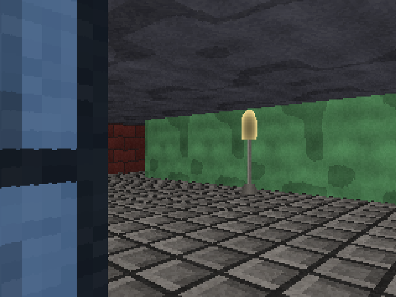

# Stage 10 — Sprites

**Tag:** `stage-10-sprites`
**Diff:** `git diff stage-09-doors stage-10-sprites`

Objects that are not walls. A sprite has no geometry at all — it is a flat picture that
always faces the camera, drawn at a position — and that is why the original could afford
hundreds of them.



Everything up to now arrived in **screen order**: one ray per column, sorted by
construction, each column independent of its neighbours. Sprites arrive in **world order**,
at arbitrary positions, and each one has to be placed, sized, sorted against the others and
tested against the walls. It is the first thing in the renderer that has to think about the
scene as a whole.

---

## Why a flat picture is enough

The illusion holds because of two constraints the engine already has: you cannot look up or
down, and you cannot roll the camera. Under those, a billboard and a real cylinder are
indistinguishable from every viewpoint the game allows.

That is also why it stopped working. As soon as a game let you look up, sprites had to start
rotating to face the camera in three dimensions, or become models.

---

## Into camera space

The camera's basis vectors are already sitting there: `plane` runs across the screen, `dir`
runs into it. So the matrix taking camera coordinates to world coordinates is `[plane dir]`,
and we want the other direction. For a 2×2 the inverse is one determinant and a shuffle:

```ts
const invDet  = 1 / (planeX * dirY - dirX * planeY);
const lateral = invDet * ( dirY   * relX - dirX   * relY);
const depth   = invDet * (-planeY * relX + planeX * relY);
```

`depth` comes out as the distance along `dir` — **exactly the quantity `perpDist`
measures**. That is the whole reason this transform is worth using rather than computing an
angle and a distance: the depth test against the wall buffer becomes a plain comparison with
nothing to convert.

### The divide I forgot

```ts
const centreX = (width / 2) * (1 + lateral / depth) - 0.5;
```

Working through the algebra, a point at distance `t` along the ray for screen position
`cameraX` gives `lateral = t * cameraX`. So `lateral` is proportional to depth, and the
perspective divide is not optional.

I left it out, and **both of my screenshots looked correct** — because the two versions
agree exactly along the view axis and diverge everywhere else, and both sprites happened to
be near the centre of the view. The test that caught it asked something an eye would not:
put a sprite one unit to the *south* and check it appears right of centre when facing east.
Worth remembering as a shape of bug: correct on the axis, wrong off it, invisible in a
screenshot taken head-on.

---

## Two different scales

```ts
const pixelsPerUnitY = height / depth;
const pixelsPerUnitX = width / (2 * PLANE_LENGTH * depth);
```

Vertically, a one-unit-tall wall at distance `d` covers `VIEW_H / d` pixels — Stage 4.
Horizontally, the camera plane spans `2 · PLANE_LENGTH · d` world units at that distance and
maps onto `VIEW_W` pixels, so one world unit is `VIEW_W / (2 · PLANE_LENGTH · d)`.

Those differ by about **1.21**, and plenty of implementations use the vertical scale for
both, which leaves every sprite subtly the wrong shape. The factor is not arbitrary: it is
the same non-square-pixel ratio that Stage 1 letterboxes 320×200 into 4:3 for. Getting it
right here is what makes a round barrel look round *on the display*, which is the only place
it matters.

---

## Standing on the floor

Centring a sprite on the horizon — the common shortcut — leaves everything hovering at eye
level. Instead each sprite is anchored by its feet:

```ts
const feet = horizon + 0.5 * pixelsPerUnitY;
const top  = feet - spriteH;
```

`horizon + 0.5 · VIEW_H / d` is Stage 7's floor-row formula, and the same line a wall's base
sits on. Standing sprites on it means a barrel rests on the floor and lines up with the wall
bases around it — verified at four distances against the floor formula directly.

Height is then a property of the object rather than of the picture, so `SPRITE_SIZES` lives
in `world/entities.ts` next to the entity, not with the artwork.

---

## The depth buffer was already there

```ts
if (depth >= hits[x].perpDist) continue;
```

That single comparison is the whole of sprite occlusion, and **no new buffer was needed**.
The ray fan already holds the perpendicular distance to the nearest wall in every screen
column — that *is* a depth buffer, one entry per column, computed as a side effect of
drawing the walls.

Doors come along for free: a door slab reports its own distance, so a sprite behind a closed
door is hidden and the same sprite seen through the open half is not.

It is per **column** rather than per pixel because in this engine a wall column is a single
flat span at one depth — the whole column is either in front of the sprite or behind it.
That is a property of the projection, not a shortcut. Give walls varying height and this has
to become a real per-pixel depth buffer.

---

## Painter's order

Sprites are drawn with a transparency *test*, not a depth test, so where two overlap the
only thing deciding which wins is paint order. They are sorted back to front each frame.

Squared distance is enough — we only ever compare, never use the value. Insertion sort
because the counts are tiny and it allocates nothing; `Array.prototype.sort` over freshly
built objects would allocate every frame, which is exactly the sort of thing that quietly
becomes a stutter three stages later. The order and distance buffers are owned by the
renderer and reused.

Verified by rendering the same pair of sprites in both list orders and confirming the
framebuffers are identical.

---

## Transparency for the price of one comparison

```ts
if (texel !== TRANSPARENT) pixels[index] = shade(texel, brightness);
```

`TRANSPARENT` is plain zero — every channel *including alpha* at 0. That makes the test a
single integer comparison, which matters because it runs once per sprite pixel.

Zero cannot collide with a real colour: `rgb()` always sets alpha to `0xff`, so even pure
black comes back as a large non-zero number. The classic alternative — reserving a visible
"magic" colour like magenta — has exactly that collision problem, and needs whoever draws
the art to remember to avoid one particular shade.

The lamp is 81% transparent, which is the point: a sprite can be any shape at all.

---

## What is deliberately missing

**Sprites do not block movement.** You can walk through a barrel. Collision would need to
consider circle-versus-circle in addition to the grid, and every one of the ten bisection
steps would pay for it — a real change to Stage 8's code, which currently never learns that
anything but the grid exists. The hook is obvious if you want it: give `SpriteKind` a
blocking radius and test it in `circleHitsSolid`.

**Sprites do not animate or face different directions.** Both are lookups rather than
geometry — pick a different texture per frame, or one of eight based on the angle between
the sprite's facing and the view. Neither changes anything in this file.

---

## Running it

```bash
npm run dev
```

<kbd>P</kbd> sprites on/off · <kbd>M</kbd> top-down view (sprites shown as markers)

### Verify

1. **Walk around a barrel.** It stays the same size and shape from every angle, and always
   faces you. That is the billboard, and it is meant to be noticeable once you look for it.
2. **Check the feet.** Sprites rest on the floor, level with the bases of nearby walls — not
   floating and not sunk.
3. **Look at one from a distance and walk up to it.** It should grow smoothly and stay
   anchored, with no drift sideways as you approach.
4. **Put a wall between you and a sprite.** It vanishes completely.
5. **Edge past a pillar with a sprite behind it.** It should be cut off exactly at the
   pillar's edge, column by column, with no bleeding.
6. **Look at a sprite through a part-open door.** The visible half shows through the gap and
   the rest is hidden by the slab.
7. **Stand so two sprites overlap.** The nearer one is in front, from every angle.
8. **Look at the lamp.** It stays bright at distance while everything around it darkens —
   it is flagged emissive and skips distance shading.
9. **Press <kbd>P</kbd>.** Walls and floors are completely unaffected.
10. **Walk into a barrel.** You pass through it — see above.

---

## What changed

```
+ src/world/entities.ts     SpriteKind, sizes, map characters, SpriteEntity
+ src/render/sprites.ts     the transform, sorting, depth test, colour-key blit
~ src/assets/textures.ts    four sprite pictures with transparent backgrounds
~ src/engine/color.ts       TRANSPARENT
~ src/world/map.ts          sprite characters parsed into an entity list
~ src/render/minimap.ts     sprite markers
~ src/render/options.ts     sprites toggle
~ src/world/levels/level1.ts  17 objects placed around the level
~ src/main.ts               P toggle, sprite pass after floors
```

---

## Next

**Stage 11** is polish: the minimap moves into a corner of the play view, the control-scheme
toggle gets a proper overlay, and the edge anti-aliasing option gets added for the
stair-stepped tops and bottoms of wall columns.
