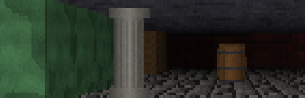
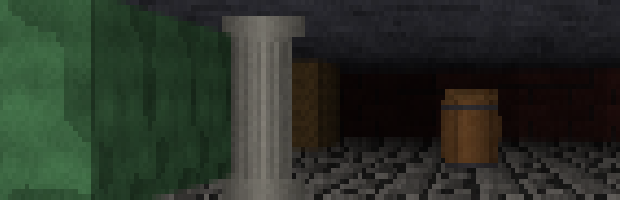

# Stage 11 — Polish

**Tag:** `stage-11-polish`
**Diff:** `git diff stage-10-sprites stage-11-polish`

The last stage. Nothing new is rendered that was not there before; what changes is that the
thing becomes usable — a minimap you can navigate by, a help overlay, runtime controls for
the two numbers most worth playing with, and the edge anti-aliasing option.

---

## Edge anti-aliasing

Wall height is quantised to whole pixels, so a smoothly changing silhouette comes out as
runs of equal height with one-pixel steps between them. Wolfenstein had exactly this, and at
320×200 upscaled to a modern window each step is several screen pixels tall.

Anti-aliasing off, and on (<kbd>X</kbd>):





The observation that makes this cheap: **vertical wall edges never stair-step.** A wall
column is exactly vertical, so the only jagged edges in the entire scene are where a column
meets the ceiling and where it meets the floor. Two pixels per column — 640 a frame — rather
than any kind of full-screen filter.

Each boundary pixel is blended by how much of it the wall actually covers:

```ts
const coverage = topRow + 1 - exactTop;
const outside  = pixels[(topRow - 1) * width + x];   // ceiling
const inside   = pixels[(topRow + 1) * width + x];   // wall
pixels[topRow * width + x] = blend(outside, inside, (coverage * 256) | 0);
```

Sampling the rows *either side* rather than reading whatever is already in the boundary
pixel keeps this independent of the rounding the wall pass happened to do. It runs after the
floor pass, because there has to be a ceiling and floor to blend against.

**It defaults to off.** The chunky look is the one this project chose, and the original had
these steps. The switch is here so you can see the difference and decide.

It costs **0.009 ms** — about 5% of a frame — and works with textures, because it blends
whatever colours are actually there.

### What it does not fix

Sprites still have hard edges: they are colour-keyed, so their silhouettes are as jagged as
the texture makes them. Softening those means blending sprite edge pixels against the
background, which needs a coverage value the colour key does not carry. Increasing the
internal resolution (<kbd>-</kbd>) helps everything at once and is the honest alternative.

---

## `blend()`, and the overflow that does not happen

```ts
export function blend(from: number, to: number, factor: number): number
```

Same alternate-byte-lane trick as `shade()` from Stage 5, done twice and added. The reason
the lanes cannot overflow into each other is worth stating rather than hoping: each
contribution is at most `255 · weight / 256`, and the two weights sum to exactly 256, so the
per-channel total is at most 255.

The ordering matters — shift each side down **before** adding. Multiply both first and the
intermediate genuinely does overflow 32 bits.

Verified against a reference implementation across 30,240 colour and factor combinations.

---

## Runtime controls

**Field of view** (<kbd>[</kbd> <kbd>]</kbd>). `planeLength` moved from a module constant
onto the `Player`, which is where it always belonged: it is camera state, and the constant
was just where it started. Widening it past about 100° gives the wide-angle stretch of a
real lens, for the same reason a real lens does it.

**Internal resolution** (<kbd>-</kbd>). Cycles 320×200, 160×100 and 640×400, reallocating
the framebuffer, ray fan and span buffers. Dropping to 160×100 makes the pixel steps
impossible to miss; 640×400 shows how much of the "retro" look is resolution rather than
technique. Worth doing right after toggling <kbd>X</kbd>.

**The minimap** (<kbd>M</kbd>) now cycles first-person → corner minimap → full top-down.
`drawMap` fills its own bounds rather than clearing the whole framebuffer, which is the one
change that let the Stage 2 debug view become an in-game overlay without duplicating it.

**Help** (<kbd>H</kbd>) lists every key, annotated with the stage that introduced it — the
switches are the walkthrough, made playable.

---

## The last allocation

Every render pass writes into preallocated buffers, so the frame allocates nothing. The one
exception was the overlay: building that string means template literals, number formatting
and concatenation, sixty times a second.

It is now rebuilt at 8Hz. Still reads as live, and the render path itself is clean.

Measured in the browser over 300 frames, idle and moving with anti-aliasing on: **0 KB heap
growth** in both cases.

---

## Where it ended up

| pass | time |
| --- | --- |
| raycast, 320 rays | 0.016 ms |
| walls | 0.049 ms |
| floors and ceilings | 0.114 ms |
| sprites (17 objects) | 0.003 ms |
| edge anti-aliasing | 0.009 ms |
| **full frame** | **0.191 ms** |

About 1% of a 60fps budget. The floor pass is still two thirds of it, exactly as it was at
Stage 7 — nothing since has come close to costing what per-pixel casting does.

---

## Running it

```bash
npm run dev
```

Press <kbd>H</kbd> for the full list.

### Verify

1. **<kbd>X</kbd> back and forth** while looking at a wall receding at an angle. The steps
   soften; the geometry does not change.
2. **<kbd>-</kbd> to 160×100, then <kbd>X</kbd>.** The effect is much more obvious, and so
   is what it cannot fix.
3. **<kbd>M</kbd> through all three views.** The corner minimap should not disturb the
   first-person image around it.
4. **<kbd>[</kbd> and <kbd>]</kbd>.** The view widens and narrows smoothly, walls stay
   straight, and sprites stay correctly proportioned — they use the live plane length.
5. **<kbd>H</kbd>.** Every key listed actually does what it says.
6. **Watch the fps** while changing resolution. 640×400 is four times the pixels and still
   nowhere near the budget.
7. **Profile a few seconds** in DevTools. The heap should be flat — no sawtooth.

---

## What changed

```
+ README.md                  the whole thing, tied together
~ src/engine/color.ts        blend()
~ src/render/walls.ts        antialiasWallEdges()
~ src/render/options.ts      edgeAntialiasing switch
~ src/render/minimap.ts      drawMap fills its bounds instead of the screen
~ src/player.ts              planeLength moved onto the camera
~ src/render/sprites.ts      uses the live plane length
~ src/main.ts                view modes, help overlay, FOV and resolution keys,
                             throttled overlay rebuild
```

---

## The end

Eleven stages, from a `Uint32Array` to a textured world with doors and objects in it,
running in about a fifth of a millisecond a frame.

If you want to keep going, the natural next steps are the ones
[stage 10](docs/stage-10-sprites.md) and the README name as deliberately absent: blocking
sprites, directional and animated sprites, and then enemies — at which point you are
writing a game rather than a renderer, and none of it needs the raycaster to change.
