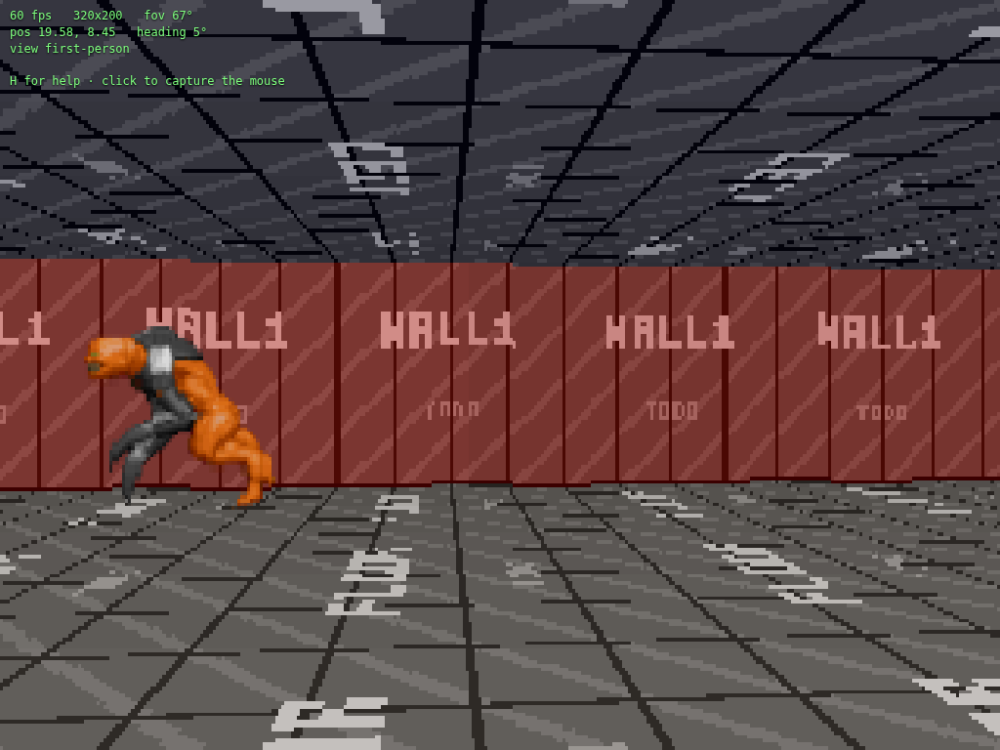

# Stage 14 — Directional and animated sprites

**Tag:** `stage-14-directional-sprites`
**Diff:** `git diff stage-13-blocking-sprites stage-14-directional-sprites`

Sprites stop being one fixed picture. An entity now has a **facing**, artwork comes in
**sheets**, and the frame you see depends on where you are standing relative to which way it
is looking. This is what every enemy in Wolfenstein 3D is built on: walk round a guard and
you see his side, then his back.

It is also the largest single addition since textures, because it touches the whole
pipeline — the artwork, the importer, the manifest, the loader, the entity model, the render
path and the fixed timestep.



---

## Eight pictures of the same thing

The convention is Doom's, and it is worth stating precisely because everything downstream
depends on it:

```
      column   0     1     2     3     4     5     6     7
             front  ...  flank  ...  back  ...  flank  ...
```

Column 0 is the entity **looking at you**. The rest walk round it in eighths. Rows are
animation frames, and an animation is a contiguous run of rows:

```
             dir 0   dir 1   dir 2  ...   dir 7
   row 0   [ walk1 ][ walk1 ][ walk1 ] ... ]   walk, frame 1, from eight sides
   row 1   [ walk2 ][ walk2 ][ walk2 ] ... ]
   row 2   [ walk3 ] ...
   row 3   [ walk4 ] ...
   row 4   [ die1  ] ...                        death, frame 1
   ...
```

Sheets are stored this way round — direction across, time down — because a frame of
animation is a *row* you can point at with one number. `firstRow` plus a frame count is the
entire description of an animation, which is what the manifest declares:

```ts
[SpriteKind.Monster]: {
  url: monster,
  animations: {
    [Animation.Walk]:  { firstRow: 0, frames: 4, frameSeconds: 0.16, loop: true },
    [Animation.Death]: { firstRow: 4, frames: 6, frameSeconds: 0.11, loop: false },
  },
},
```

Timings live with the artwork rather than with the entity, because they *are* a property of
the artwork: how many frames the walk was drawn with, and how fast it reads. What the entity
decides is only *which* animation is playing.

---

## Five drawn, three mirrored

Nobody draws eight views. The original games drew five — front, front-quarter, flank,
back-quarter, back — and mirrored three of them, because a creature seen from its left is
its right-hand view flipped. That halves the artwork for anything roughly symmetrical, which
is most things.

[`tools/import-sprites.mjs`](../tools/import-sprites.mjs) does that conversion. Point it at
a third-party sheet and it produces the uniform grid above:

```bash
node tools/import-sprites.mjs source.png src/assets/images/monster.png \
  --rows=0:dir,1:dir,2:dir,3:dir,8:seq
```

A `dir` row is one animation frame drawn from several rotations, and becomes one output row.
A `seq` row is several frames of a single view, and becomes several output rows with the
same picture in all eight columns — which is exactly right for a death, since a creature
falling over looks much the same from wherever you happen to be standing.

Three details in there are not obvious, and all three were bugs first:

- **Key the background out before scaling.** Scale first and the interpolator blends the key
  colour into every edge pixel, so the cutout gets a halo of whatever the background was.
- **One scale for the whole sheet.** Importing the walk and the death separately gave them
  scales of 0.76 and 0.99, so the monster changed size when it died. The scale is computed
  once, from the largest frame anywhere in the import.
- **Leave a margin.** With the scale chosen so the widest pose exactly fills its cell, the
  flank views sat flush against both edges and the anti-aliased silhouette was cut off
  square. One texel of margin fixes it, and the browser suite now checks for it.

---

## The orientation trap

Which column means "seen from the front", and which way the other seven go round, is a
*convention*. Conventions cannot be checked by eye: a mirrored monster still looks like a
monster. This project has already shipped six stages with every wall texture flipped, found
only when someone measured with a ruler texture.

So the direction lookup is derived, then asserted:

```ts
const toViewer = Math.atan2(viewerY - entityY, viewerX - entityX);
return Math.round((entityAngle - toViewer) / step) & (columns - 1);
```

The angle is between where the entity is **facing** and where the viewer **is**. Facing you
gives zero; the viewer directly behind gives four.

The sign is the whole game. Getting it backwards swaps the two flanks — which looks
perfectly plausible in a still frame and is obviously wrong the moment anything turns. The
correct sign was read off the artwork, not guessed: for the entity facing east with the
viewer to its south, the viewer looks north, so their screen-right is east and the creature
is facing across the screen to the right. That is the view stored in **column 6**; column 2
shows it facing screen-left.

`& (columns - 1)` both wraps and absorbs the negative results `Math.round` produces, since
JavaScript's bitwise operators work on two's-complement 32-bit integers. It needs a
power-of-two column count, which the eight-direction convention guarantees.

**Every check of this has a negative control.** `tools/verify/node/sprites.ts` asserts that
the opposite sign convention *agrees on front and back and disagrees on both flanks* —
proving that the flank checks are the ones doing the work, and that a mirrored sheet would
fail rather than sail through. Front and back alone would pass under either convention,
which is precisely why they are not enough.

---

## Animation belongs in `update`, not `render`

```ts
map.doors.update(dt, playerOccupies);
updateEntities(map.sprites, behaviourContext, entityTiming);
```

Both are in the fixed-timestep `update`, and for the same reason: animation driven off the
render loop runs at whatever rate the display happens to refresh at, so a walk cycle would
play twice as fast on a 120 Hz monitor. `advanceAnimation` also loops rather than branches,
subtracting a frame time at a time, so a long step lands where many short ones do. A
one-shot animation stops on its last frame — a death animation ends as a corpse.

---

## The behaviour hook

`SpriteEntity` gains one optional field:

```ts
behaviour?: (entity: SpriteEntity, ctx: BehaviourContext) => void;
```

The engine calls it once per entity per tick and does nothing else with it. There is no
command queue and nothing to register: position, facing and current animation are plain
mutable fields, so a behaviour just assigns to them. The context hands over the whole map
and the player rather than a curated subset, because guessing now at what a game's enemies
will need to see is how an interface ends up widened once per feature.

[`src/world/demo-patrol.ts`](../src/world/demo-patrol.ts) is the first user, and is
deliberately stupid: walk forward, turn a quarter circle when something is in the way. It is
not AI — there is no sight, no pursuit, no reaction to the player at all. **Deleting that
file must leave a working engine**, and only one line in `main.ts` references it. That is the
test of whether a seam is real.

Moving entities did force two genuine engine changes, both in collision.

`slideMove` and `circleHitsSolid` gained an `ignore` parameter, because an entity's own
blocking circle is in the same list everything else tests against — without excluding itself,
a monster is permanently jammed inside its own collision shape and never moves at all.

### The escape hatch became a hole in the world

The second was reported from play: **standing next to a monster and a wall, you walked
through the wall.**

Stage 8 ended with a safety valve. If a body is somehow already inside geometry, every
direction is blocked and it is trapped forever, so the move is let through unchecked:

```ts
if (circleHitsSolid(map, position.x, position.y, radius)) {
  position.x += dx; position.y += dy; return;   // walk out of it
}
```

That reasoning held for four stages because nothing could get inside you. An overlap meant a
badly authored level: rare, static, and unrecoverable without the valve. Stage 14 quietly
invalidated the premise. A monster now walks over to where you are standing, so the overlap
arrives every few seconds — and "let the move happen unchecked" disables collision against
*everything*, the grid included. Overlap a monster while facing a wall and you leave the
level.

The fix is to stop treating the two kinds of geometry as one thing:

```ts
// Inside a wall: unrecoverable, so keep the old escape.
if (circleHitsSolid(map, position.x, position.y, radius, NO_ENTITIES)) { /* unchecked */ }

// Inside an entity: entities stop blocking until you are clear. Walls never stop.
const blockers = circleHitsSolid(map, position.x, position.y, radius, ignore)
  ? NO_ENTITIES
  : ignore;
```

You can always walk out of something that walked into you, and you can never leave the level
to do it.

The lesson is not about collision. A safety valve is written against an assumption about how
often the bad state happens, and **that assumption is invisible in the code** — nothing in
`slideMove` recorded that "already inside geometry" was supposed to mean "once per badly
authored level". Four stages later a different file made it routine, and the valve was still
sitting there being generous. The stage 8 document now carries a note pointing here.

---

## Cost

Re-measured at 320×200, median of 3000 frames, on the same level (20 entities, 3 of them
animated and moving):

| pass | time |
| --- | --- |
| entity update (behaviour + animation) | 0.001 ms |
| raycast, 320 rays | 0.013 ms |
| walls | 0.046 ms |
| floors and ceilings | 0.092 ms |
| sprites | 0.001 ms |
| edge anti-aliasing | 0.007 ms |
| **full frame** | **0.159 ms** |

Retained heap growth over 300 frames: **0 KB**, unchanged. Two things were needed to keep
that true: the behaviour context object is reused between ticks rather than built fresh, and
the patrol driver records its previous position in two numbers rather than an object. Neither
matters at these sizes; the claim that a steady frame allocates nothing is only worth making
if it stays true.

Choosing a cell is an `atan2`, a rounding and a mask per sprite per frame, which does not
register against the cost of actually drawing it.

---

## Verification

`npm run verify` — [`node/sprites.ts`](../tools/verify/node/sprites.ts), 30 checks:

- **Sheet slicing** against a synthetic sheet where every cell is a different colour, sampled
  at three corners of each cell, with a transposed read asserted *not* to match.
- **Direction selection** from known viewpoints, plus a rotation sweep proving the index
  depends only on the relative angle — and the negative control described above.
- **The renderer actually drawing the chosen cell**, read back out of the framebuffer from
  four viewpoints, with a control asserting the four views differ from one another. (The
  first version of this check placed every viewer on the *opposite* side of the monster and
  reported the renderer four cells out. The test was wrong; the engine was right.)
- **Animation timing** under the fixed timestep: wrap, remainder carried, one-shot clamping,
  and one long step landing where a hundred short ones do.
- **The behaviour hook**: called once per entity per tick, its mutations stick, and entities
  without one survive the same call untouched.

`node/collision.ts` gained a section for the escape-hatch bug: overlapped by a monster and
pushed at a wall, the body stops at the wall face rather than leaving the level; it can still
walk out of the monster; a body genuinely inside a *wall* can still escape unchecked; and
200,000 random moves with a monster deliberately parked on top of the body never end inside a
wall.

`npm run verify -- --all` adds the browser checks, which are the only ones that can see the
real PNG: the sheet divides evenly into 64px cells, every cell has art, every cell reaches
the feet line, nothing touches a side edge, the manifest's animations fit inside the rows
that exist, and all eight loaded directions are genuinely different pictures.

---

## What this does not do

No AI, no attacks, no death triggered by anything — nothing plays the death animation in the
shipped demo, because nothing can die. That is the game layer, and it is the subject of
`docs/extending.md` in stage 17.

The next stage is the last genuine *renderer* gap: pushwalls, a whole cell that moves.
