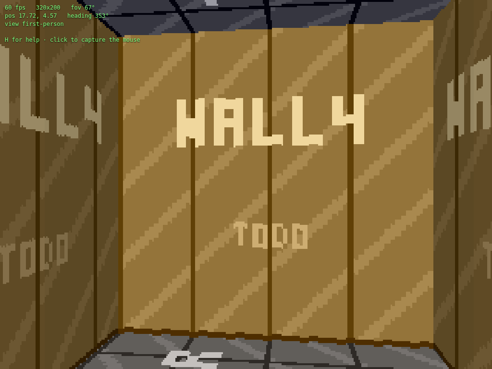

# Stage 15 — Pushwalls

**Tag:** `stage-15-pushwalls`
**Diff:** `git diff stage-14-directional-sprites stage-15-pushwalls`

A pushwall is a wall that looks like every other wall until you press use against it, and
then grinds two cells back to reveal a passage. It is Wolfenstein's secret door, and it is
the **last genuine gap in this renderer** — the one feature so far that the DDA could not
express at all.



---

## Why this one is different

Every solid surface in the engine up to now has been on a grid line. That is not a
convenience, it is the reason the DDA works: it steps from one grid crossing to the next, so
it *lands* on wall faces rather than searching for them, and the distance it lands with is
exact.

Doors bend that a little. A door's slab sits half a cell inside its cell, so the ray has to
solve for the crossing — but the slab is still a plane at a coordinate known in advance,
which is one division.

A pushwall is a **whole cell that moves**. While it travels it is a unit box at a fractional
offset, straddling two cells, and a ray can enter it through any of four faces:

```
        cell A          cell B
     ┌───────────┬───────────┐
     │     ╔═════╪═════╗     │      it has left A and not yet filled B;
   ──┼──── ║ ─── │ ─── ║ ────┼──    rays entering either cell must be tested
     │     ╚═════╪═════╝     │      against the box, not against the cell
     └───────────┴───────────┘
            travel = 0.5 →
```

---

## Where the state lives

The continuous part — direction, how far it has travelled, whether it is still going — lives
in `PushwallSystem`, updated on the fixed timestep beside doors.

The *discrete* part goes into the tile grid. As the box moves, the cells it covers are
written as `Tile.Pushwall` and the cells it has left are written back to `Tile.Floor`. This
is the one place in the engine where the map is written to at run time, and it is worth the
oddity:

**The DDA already reads the tile of every cell it enters.** A side table of occupancy would
add an array read to the innermost loop of the renderer — several hundred thousand times a
second, to answer "no" — for a feature that is idle in almost every frame of almost every
level. Marking the grid means pushwalls cost *nothing at all* until a ray actually enters
one. It is also what the original engine did, for the same reason.

A pleasant consequence: the minimap, which draws the tile grid, shows the secret opening
without knowing pushwalls exist.

---

## The ray test

```ts
const enter = Math.max(nearX, nearY);
const exit  = Math.min(farX, farY);
if (enter > exit || enter < 0) return false;
```

The standard slab intersection: clip the ray against the box's x band and its y band, and
whatever interval survives in both is the part of the ray inside the box. Two details are
worth naming.

**The face you hit is whichever band you entered last.** `nearX > nearY` means the ray was
still outside the x band when it entered the y band, so it came in through a vertical face.
That is a two-line answer to a question that looks like it needs four cases.

**One cell has to own the hit.** The box spans two cells, and the test runs in each cell the
DDA enters, so without a rule the wall would be drawn twice — once from each side. The rule
is that a cell claims the crossing only if the crossing lies inside it. Cells are visited in
ray order, so the first claim is the nearest one, which is why the containment test can
afford to be generous at the shared boundary: a hit claimed twice is harmless, a hit claimed
by neither is a hole in a solid wall.

**The texture is measured from the box, not from the cell.** Same rule a sliding door
already follows: the material moves with the wall. Measure from the cell instead and the
artwork stays pinned to the world while the wall slides across it — brickwork flowing
through stone.

---

## Two answers to "is this solid?"

This is the part that took the most thought, and it is a genuine split rather than a fudge.

`GameMap.isSolid` answers per *cell*, because that is what a grid can say. For a travelling
pushwall it answers **false** for both cells the box straddles, and collision tests the box
itself instead — the same clamp-to-nearest-point trick the cell loop uses, on a box that
happens not to be aligned.

The alternative — calling both cells solid — is simpler and wrong in a way you would feel
immediately: you would stop up to a whole cell short of a wall you can plainly see, with
empty floor between you and it. `tools/verify/node/pushwalls.ts` asserts the two agree by
measuring them against each other: where the renderer draws the face, and where collision
stops you, differ by exactly one player radius.

At rest the box fills its cell exactly, so both answers coincide and it is an ordinary wall
again — which is what makes this split cost nothing in the overwhelmingly common case.

---

## It holds; it does not reverse

A door that is closing on you reopens. A pushwall that is about to cover ground you are
standing on **stops and waits** instead, and resumes when you move.

The occupancy rule is the same one doors use — the same callback, even — but the response is
deliberately different. Reversing returns a door to the state you asked for, which is
helpful. Reversing a pushwall would undo a secret you had deliberately found, and leaning on
it would shuffle it back and forth. Waiting preserves the intent and cannot loop.

> **Amended after stage 17, from a bug report.** The first version of this asked the
> occupancy question about **cells**: "would the box, moved on, touch a cell somebody is
> standing in?" That is the right question for a door, whose slab fills its cell, and it is
> the wrong question here for exactly the reason the section above gives — a travelling box
> spans two cells and covers only part of each.
>
> The symptom: push a secret and walk after it, and it stops dead. The player pressed against
> the wall — the only place you can be when you push it — overlapped a cell the box still
> partly covered, so the very first tick of travel held. And the hold never released, because
> the wall had to move for the overlap to end and it could not. A permanent deadlock, one
> step into the feature.
>
> The question is now geometric, matching collision and the renderer: *would the box at its
> next position overlap this body?* Since the box always travels away from whoever pushed it,
> that can never be true for the pusher — while somebody standing in its path still stops it,
> now one radius short of touching them rather than a whole cell early. See
> [`world/occupancy.ts`](../src/world/occupancy.ts).
>
> Worth naming the pattern, because it is the third time in this project: **a coarse test
> standing in for a fine one is a bug waiting for someone to stand on the boundary.** This
> document already argued that point about `isSolid` two sections up, and then the code went
> and made the same mistake in the callback next door.

---

## Rejected at parse time

A pushwall boxed in on all four sides is not a secret, it is a wall — and an invisible
mistake, because it looks completely correct until someone stands in front of it pressing
use and nothing happens. `parseMap` rejects it, alongside the door with no frame and the
level with a hole in its outer wall.

It travels up to two cells and stops early against anything solid, rather than refusing a
push with only one cell behind it. A secret that silently does nothing is indistinguishable
from a wall, which is a miserable thing to debug in a level.

---

## Cost

Median of 3000 frames at 320×200:

| | idle | sliding, filling the view |
| --- | --- | --- |
| raycast, 320 rays | 0.014 ms | 0.013 ms |
| **full frame** | **0.160 ms** | **0.157 ms** |

Unchanged, which was the thing to check: stage 9 added a branch to the DDA for doors and
cost nothing measurable, and this adds a second one. The moving column shifts work between
the wall and floor passes — standing close to a wall makes its spans taller and leaves fewer
floor rows — but the totals are the same. Retained heap growth over 300 frames with a
pushwall in flight: **0 KB**.

The one operation that was not O(1) has been removed: releasing the cells a pushwall used to
cover was a scan of the whole grid per tick, and is now two array writes, since a unit box
travelling along one axis covers at most two cells.

---

## Verification

`tools/verify/node/pushwalls.ts` — 38 checks, each parsing its own map, because a moving
pushwall rewrites the grid and a shared level would let one check change the world another
is asserting about:

- **Parsing**: `P` becomes a pushwall, is solid at rest, and one walled in on all four sides
  is rejected with a message that says why.
- **Pushing**: it travels two cells, stops early when only one is free, refuses a direction
  with no room, refuses a second push mid-flight, and rewrites the grid so the cells it left
  are floor and the cell it reached is wall.
- **The ray hits the box where the box is**: the west face is asserted at the exact expected
  distance at seven different travels, and a ray aimed through the strip it has vacated is
  asserted to pass through and hit something else.
- **The texture travels with the wall**: the same material point sampled at two travels gives
  the same coordinate, with the cell-relative reading asserted to *differ* as the control.
- **Collision agrees with the render**, measured against each other rather than both against
  a constant.
- **It will not close on you**, and carries on once you move.
- **Travel is frame-rate independent**: the same journey takes the same time at 240 Hz and
  30 Hz.

Fourteen of those failed on the first run, and every one was the test's fault. Two were
plain mistakes — a map with no spawn marker, an expectation that a direction was blocked when
it was not. The other twelve came from one shortcut: the test set `travel` directly instead
of driving the system, so the tile grid still described where the box *had been*. The
renderer, which reads the grid, was measured against a world the game can never be in and
looked badly broken; collision, which reads the box, quietly disagreed with it. The
disagreement was the tell.

That is the same lesson as stage 13 and stage 14, and it now has a name in
`tools/verify/README.md`: **when a new check fails, suspect the check first.**

---

## What is left

This is the last of the renderer gaps. What remains is sound (stage 16) and the seams a game
attaches to (stage 17).
